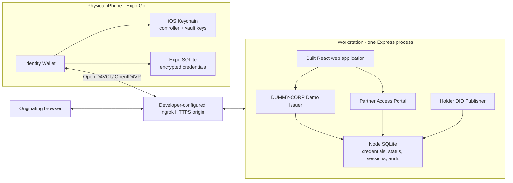

# Identity Wallet Demo

A complete, test-driven demonstration of a decentralized identity wallet using
React Native, Expo Go, `did:web`, OpenID for Verifiable Credentials, SD-JWT,
and a companion React web application.

The project demonstrates a realistic employee-credential journey without a
blockchain, cryptocurrency, or locally operated ledger node:

1. an iPhone wallet creates and controls a `did:web` identity;
2. a demo issuer delivers a holder-bound employee credential;
3. the wallet encrypts the credential on the device;
4. a relying party requests only the claims it needs;
5. the holder explicitly approves or denies disclosure;
6. the relying party independently verifies the proof and credential status;
7. the originating browser receives short-lived access.

> [!IMPORTANT]
> This repository is demonstration software. It uses synthetic employee data,
> Expo Go software keys, a developer-supplied HTTPS domain, and one workstation
> process.
> It is not a production wallet, identity provider, or authorization system.

## Highlights

- iPhone-only React Native wallet running in Expo Go
- no blockchain node or smart contract
- domain-based holder, issuer, and relying-party DIDs
- OpenID4VCI pre-authorized credential issuance
- six-digit transaction code delivered separately from the offer QR
- SD-JWT selective disclosure with ES256 holder binding
- OpenID4VP signed Request Objects and DCQL claim selection
- explicit allow and deny actions
- encrypted credential vault using XChaCha20-Poly1305
- Expo SQLite ciphertext storage
- iOS Keychain-backed vault and controller keys through Expo SecureStore
- signed compressed Token Status List
- credential revocation, supersession, removal, and expiration handling
- browser-bound, ten-minute partner-access sessions
- one Express process serving APIs, SQLite state, and the built React site
- short-lived reference-only QR codes
- idempotent exchange completion, startup cleanup, and rate limiting
- automated protocol, HTTP, SQLite, mobile UI, and web UI tests

## Demo identities

The identity profile is derived at runtime from the public HTTPS origin in
`.env`. For example, this configuration:

```text
https://wallet.example.com
```

| Role | Identifier |
| --- | --- |
| Holder | `did:web:wallet.example.com` |
| Issuer | `did:web:wallet.example.com:issuer` |
| Relying party | `did:web:wallet.example.com:rp` |
| Credential type | `https://wallet.example.com/credentials/employee/v1` |

The employee record is entirely synthetic:

| Field | Value |
| --- | --- |
| Name | Alya Pratama |
| Email | `alya.pratama@employee.test` |
| Employee ID | `EMP-DEMO-001` |
| Department | Digital Trust Lab |
| Employer | DUMMY-CORP |
| Employment status | Active |

## Architecture



Companion Web combines three logical roles in one process for easy local
demonstration. The issuer and relying party still use separate persistent keys
and separate DID documents.

## Standards profile

The implementation is intentionally narrow and pinned:

- OpenID for Verifiable Credential Issuance 1.0
- OpenID for Verifiable Presentations 1.0
- OAuth SD-JWT, RFC 9901
- SD-JWT VC draft 17
- Token Status List draft 20
- DID Core and `did:web`
- P-256 / ES256 signatures
- SHA-256 disclosure digests and JWK thumbprints
- XChaCha20-Poly1305 local authenticated encryption

The issued object is an IETF SD-JWT Verifiable Digital Credential. It does not
claim W3C JSON-LD Verifiable Credential conformance.

## Repository layout

```text
.
├── App.tsx                    Expo application entry point
├── src/
│   ├── adapters/              Expo storage, randomness, and HTTP adapters
│   ├── bootstrap/             Production wallet composition
│   ├── credentials/           SD-JWT, issuance, request, and status logic
│   ├── ui/                    React Native wallet screens
│   └── wallet/                DID controller, vault, and exchange capabilities
├── companion/
│   ├── cli.ts                 Companion Web executable
│   ├── database.ts            Node SQLite persistence
│   └── server.ts              Express API and built-site server
├── web/
│   ├── src/                   Issuer and Partner Access React UI
│   └── vite.config.mts        Development proxy and production build
├── publisher/                 Earlier publisher-compatible seam and tests
├── fixtures/                  Deterministic public test material
├── docs/                      Architecture decisions and validation record
├── research/                  Supporting platform and protocol research
└── package.json               Mobile, web, server, and validation scripts
```

Tests live next to their public seams and under `companion/`.

## Prerequisites

- Node.js 24 or newer
- npm
- ngrok 3
- access to a reserved ngrok domain or another HTTPS origin
- current App Store Expo Go compatible with Expo SDK 54
- a physical iPhone
- iPhone and workstation connected to the same LAN for Metro

Node 24 is required because Companion Web uses the built-in `node:sqlite`
module.

## Installation

Clone the repository and install the exact dependency graph:

```bash
git clone <your-repository-url>
cd did-demo
npm ci
```

Validate the Expo environment:

```bash
npx expo-doctor@latest
```

Create the ignored local configuration:

```bash
cp .env.example .env
```

Edit `.env`, set both origin variables to the same ngrok HTTPS origin, and
replace the example Operator Token with a long random value:

```dotenv
PUBLIC_ORIGIN=https://wallet.example.com
EXPO_PUBLIC_COMPANION_ORIGIN=https://wallet.example.com
OPERATOR_TOKEN=replace-with-a-long-random-value
```

`PUBLIC_ORIGIN` configures Companion Web.
`EXPO_PUBLIC_COMPANION_ORIGIN` is embedded into the Expo application and is
therefore public. `OPERATOR_TOKEN` is server-only and must never use the
`EXPO_PUBLIC_` prefix.

## Run everything

Use three terminals. No Expo tunnel is required.

### Terminal 1: build and start Companion Web

```bash
npm run web:build
npm run companion
```

Expected startup output:

```text
Credential Exchange Demo listening locally at http://0.0.0.0:8787
Public origin: loaded from .env
Operator token: loaded from .env
```

Use the Operator Token stored in your local `.env`. The same value is entered
in:

- Identity Wallet when creating or reconnecting the wallet; and
- Credential Exchange Demo when unlocking the Issuer desk.

Do not commit, publish, or place the Operator Token in an `EXPO_PUBLIC_`
variable.

### Terminal 2: expose Companion through ngrok

```bash
set -a
. ./.env
set +a
ngrok http 127.0.0.1:8787 \
  --url "$PUBLIC_ORIGIN" \
  --inspect=false
```

Confirm the public service:

```bash
set -a
. ./.env
set +a
curl --fail-with-body "$PUBLIC_ORIGIN/healthz"
```

Open `PUBLIC_ORIGIN` in the workstation browser.

### Terminal 3: start Metro

```bash
npm start
```

Scan Metro's QR code with the iPhone and open it in Expo Go.

There are two different QR channels:

- the Metro QR loads the JavaScript application over the LAN;
- issuer and relying-party QRs contain short-lived HTTPS references to
  Companion Web through ngrok.

The configured ngrok domain is not an Expo tunnel and does not transport the
Metro development bundle.

## Complete demo walkthrough

### 1. Create or reconnect the wallet

1. Open Identity Wallet in Expo Go.
2. Enter the current Operator Token from your local `.env`.
3. Choose **Create my wallet** on first use, or **Reconnect wallet** when an
   identity key already exists.
4. Wait for the holder DID to be published, resolved, and proven.

The P-256 controller private key remains on the iPhone.

### 2. Issue an employee credential

1. Open **Issuer desk** in Companion Web.
2. Enter the Operator Token and unlock the desk.
3. Select the Alya Pratama record.
4. Choose **Create credential offer**.
5. In Identity Wallet, open **Scan** and scan the offer QR.
6. Enter the six-digit transaction code displayed separately by the issuer.
7. Choose **Accept credential**.

The issuer marks the exchange accepted only after encrypted vault persistence
succeeds on the iPhone.

### 3. Request and share a proof

1. Open **Partner access** in Companion Web.
2. Choose **Request wallet proof**.
3. Scan the request QR with Identity Wallet.
4. Review the relying party and requested claims.
5. Choose **Share 3 claims**.

The wallet discloses only:

- name;
- employer; and
- employment status.

It withholds email, employee ID, department, the complete credential, and
undisclosed SD-JWT disclosures.

Only the browser that created the request receives the protected partner
session.

### 4. Demonstrate denial

Create another Partner Access request, scan it, and choose **Deny request**.
The request is consumed without sending a credential or claim value.

### 5. Demonstrate lifecycle controls

- Revoke the active credential from Issuer desk.
- Refresh the wallet and confirm the credential is marked revoked.
- Attempt another Partner Access request and confirm access is denied.
- Remove and revoke from the wallet when demonstrating holder-initiated
  removal.
- Confirm controller-key rotation is unavailable while an active credential is
  bound to the current key.
- Use the two-stage **Reset demo** action to remove holder and exchange state
  while preserving issuer and relying-party identities.

## Development commands

| Command | Purpose |
| --- | --- |
| `npm start` | Start Expo Metro in LAN mode |
| `npm run start:tunnel` | Start an Expo tunnel when LAN Metro is unavailable |
| `npm run companion` | Start the production-shaped Express companion |
| `npm run web:dev` | Start Vite with API proxying to port 8787 |
| `npm run web:build` | Build the web application into `dist/web` |
| `npm test` | Run all Jest suites once |
| `npm run test:watch` | Run Jest in watch mode |
| `npm run typecheck` | Check mobile, publisher, companion, and web TypeScript |
| `npm run lint` | Run Expo ESLint |
| `npm run check` | Run tests, typecheck, and lint |
| `npm run export:ios` | Produce an iOS Hermes export under `dist/` |

For web UI development, run Companion and Vite in separate terminals:

```bash
npm run companion
npm run web:dev
```

## Configuration

Companion accepts these process environment variables:

| Variable | Required | Description |
| --- | --- | --- |
| `PUBLIC_ORIGIN` | yes | Companion's public HTTPS base URL |
| `EXPO_PUBLIC_COMPANION_ORIGIN` | yes | Same public URL embedded into Expo |
| `OPERATOR_TOKEN` | yes | Server-only privileged demo credential |
| `HOST` | no; `0.0.0.0` | Local bind address |
| `PORT` | no; `8787` | Local HTTP port |
| `STATE_DIRECTORY` | no; `.data` | SQLite and persistent role-key directory |
| `STATIC_DIRECTORY` | no; `dist/web` | Built React asset directory |

The tracked [`.env.example`](.env.example) documents the complete shape.
The actual `.env` is ignored. `npm run companion` loads it through Node's
`--env-file` support, while Expo CLI loads the `EXPO_PUBLIC_` endpoint.

### Using another domain

`did:web` identifiers, audiences, status URIs, and credential metadata are
derived from the configured origin. Change both `PUBLIC_ORIGIN` and
`EXPO_PUBLIC_COMPANION_ORIGIN` together, restart Companion, and restart Metro
with `npx expo start -c`. Existing issued credentials and published DID state
belong to the previous origin; remove `.data/` and reset the wallet before
creating a new demo identity.

## Public HTTP surface

| Route | Purpose |
| --- | --- |
| `GET /healthz` | Companion readiness |
| `GET /.well-known/did.json` | Holder DID document |
| `PUT /api/did` | Protected holder DID publication |
| `GET /issuer/did.json` | Issuer DID document |
| `GET /rp/did.json` | Relying-party DID document |
| `GET /credentials/employee/v1` | Employee credential type metadata |
| `GET /status/employee` | Signed compressed credential status list |
| `GET /.well-known/openid-credential-issuer` | Issuer metadata |
| `POST /oid4vci/token` | Pre-authorized access token |
| `POST /oid4vci/nonce` | Fresh credential-proof nonce |
| `POST /oid4vci/credential` | Employee credential issuance |
| `POST /oid4vci/notification` | Wallet persistence acknowledgement |
| `GET /rp/requests/:id` | Signed presentation Request Object |
| `POST /oid4vp/direct_post` | Presentation or claim-free denial |
| `POST /api/rp/requests` | Browser-bound partner request creation |

Offer creation, DID publication, revocation, summary, and reset operations
require the current Operator Token.

## Storage and privacy

### iPhone

- SecureStore holds the controller key and 256-bit vault key using
  `WHEN_UNLOCKED_THIS_DEVICE_ONLY`.
- Expo SQLite holds only XChaCha20-Poly1305 nonce and ciphertext records.
- decrypted credential material is cleared from memory when the app
  backgrounds.
- activity receipts contain outcomes and claim names, not claim values or
  protocol artifacts.

### Companion

- `.data/demo.sqlite` stores credentials, statuses, exchanges, and claim-free
  audit events.
- `.data/role-keys.json` stores persistent issuer and relying-party signing
  keys.
- incomplete exchange sessions are removed during startup.
- disclosed partner claims live only for the short browser session.

All runtime state and key material is excluded by `.gitignore`.

## Security properties

- reference-only QR codes contain no claims or credentials;
- offers and presentation requests expire after five minutes;
- transaction codes are six-digit and single-use;
- OpenID4VCI proofs are nonce-bound to the holder DID key;
- issuer and relying-party keys are independent;
- the wallet accepts only the pinned issuer and relying-party profile;
- presentations use exact DCQL claim matching;
- over-disclosure is rejected;
- key-binding JWTs include audience, nonce, issue time, and SD-JWT hash;
- the relying party checks issuer signature, holder binding, expiry, audience,
  nonce, disclosure set, access policy, and live revocation status;
- result access is bound to an HttpOnly, SameSite browser cookie;
- completion endpoints are idempotent;
- sensitive write and exchange endpoints are rate-limited;
- private keys are never encoded in QR payloads or browser responses.

## Known limitations

- This is a single-workstation demonstration, not a distributed deployment.
- Expo Go cannot provide an app-owned Secure Enclave key or app-specific Face
  ID configuration.
- Direct-post responses use TLS but are not additionally encrypted with JWE.
- Credential and partner verification intentionally fail closed when required
  online services are unavailable.
- The employee schema and single issuer/relying-party profile are fixed; their
  `did:web` identifiers are derived from the configured domain.
- The browser portal is not an account system.
- The project does not implement general-purpose credential discovery,
  multiple credential types, backup, synchronization, or recovery.
- The pinned Expo SDK and React Native dependency tree may report transitive
  `npm audit` advisories. Do not apply `npm audit fix --force`; upgrade the
  Expo/React Native baseline as a coordinated change.

## Testing

The TDD suite covers:

- DID document validation and RFC 7638 thumbprints;
- independent ES256 proof vectors and negative cases;
- SD-JWT issuance, disclosure digests, holder binding, and over-disclosure;
- exact Employee Credential DCQL matching;
- encrypted-vault round trips and tamper rejection;
- persistence-before-acknowledgement ordering;
- real HTTP OpenID4VCI issuance backed by temporary SQLite;
- signed RP requests, selective disclosure, denial, and browser binding;
- revocation denial and Token Status List verification;
- restart persistence, idempotency, rotation guards, and rate limits;
- React Native wallet behavior;
- React issuer behavior and reference QR rendering.

Run all repository checks:

```bash
npm run check
npx expo-doctor@latest
npm run web:build
npm run export:ios
```

The latest workstation validation record is available in
[`docs/validation.md`](docs/validation.md).

## Troubleshooting

### Expo does not show the Operator Token prompt

Expo may have restored an existing controller key. Reload the current bundle:

```text
Press r in the Metro terminal
```

The wallet will show **Reconnect wallet** when its DID is not verified against
the current Companion session. If an old UI remains cached:

```bash
npx expo start -c
```

### `Cannot read property 'requireSecretKey' of undefined`

This was caused by detaching the controller presentation method from its wallet
instance. The regression is covered by the credential-exchange test. Pull the
latest source, reload Expo Go, and create a new Partner Access request.

### The Operator Token is rejected

Use `OPERATOR_TOKEN` from the same `.env` loaded by the currently running
`npm run companion` process. Restart both Companion and Metro after changing
environment configuration.

### Partner Access stays on “waiting”

- confirm the request is less than five minutes old;
- confirm the iPhone can reach the configured ngrok origin;
- reload the browser only if it preserves the originating session cookie;
- create a new request after an Expo reload because pending mobile UI state is
  intentionally not persisted.

### ngrok returns 502

Confirm Companion is listening locally and that ngrok targets the same port:

```bash
curl --fail-with-body http://127.0.0.1:8787/healthz
```

### Metro cannot reach the iPhone

Keep the iPhone and workstation on the same LAN. If the network blocks local
device traffic, use:

```bash
npm run start:tunnel
```

This Expo tunnel is separate from the ngrok route used by `did:web`.

## Further documentation

- [Architecture and TDD seams](docs/decisions/architecture-and-tdd.md)
- [Credential exchange experience](docs/decisions/credential-exchange-experience.md)
- [Architecture decision records](docs/adr/)
- [Validation record](docs/validation.md)
- [DID and proof research](research/did-web-proof-profile.md)
- [Expo Go cryptography research](research/expo-go-crypto-stack.md)
- [ngrok and iPhone research](research/ngrok-iphone-publisher.md)

## Contributing

Before opening a pull request:

```bash
npm ci
npm run check
npx expo-doctor@latest
npm run web:build
```

Do not commit `.data`, `.env` files, Operator Tokens, SQLite files, role keys,
Expo caches, build output, or local issue-tracker metadata.

## License

No license file is currently included. Add an appropriate license before
redistributing or accepting external contributions.
